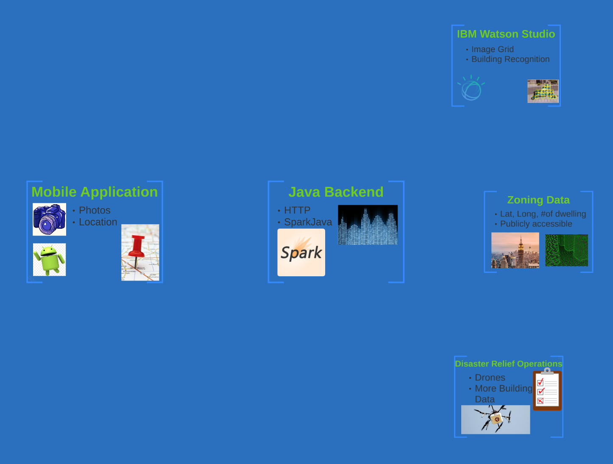
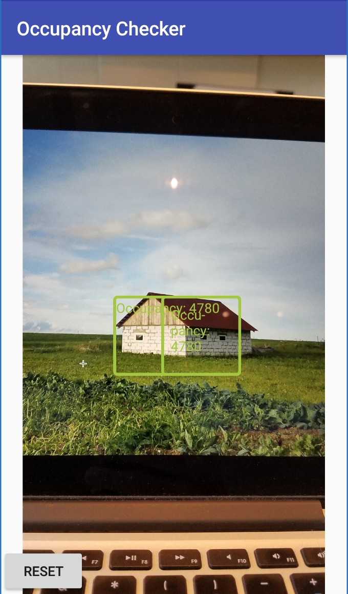

This weekend[^1] I participated in my first hackathon, IBM's [Call for
Code](https://callforcode.org/). I entered on a whim, and found out one of my
close friends [Matt Brown](https://github.com/mattyb5722) was attending as
well. We decided to form a team and give it our best shot, though we went in
with no idea, and not expecting to stay the night. In the end, we came up with
an idea, and got so involved that we spent the full 24 hours prototyping it,
ultimately winning third place!

# The Idea:

After sitting through the hackathon's opening ceremonies, we spent the first
few hours "brainstorming", which mainly involved going back to our dorm,
grabbing a frisbee, and tossing it back and forth while trying to come up
with disasters. The theme of the hackathon was disaster preparedness and
disaster relief, and we spent quite some time trying to find an idea within
this topic that would be both useful, but also feasible for a team of two
with limited resources and experience to prototype in less than 24 hours.
We knew we wanted to actually build our idea, and were there to learn new
tools and technologies, so feasibility was more important to us than having
the best possible concept. 

Perhaps we needed some data for inspiration.  Googling free datasets led us to
[publicly avilable zoning data for New York
City](https://data.cityofnewyork.us/Housing-Development/DOB-Certificate-Of-Occupancy/bs8b-p36w),
which I found very intersting as it seemed to list the number of dwellings in a
building not only by street adress, but also directly by latitude and
longitude. Perhaps we could use this information to help first responders
assess and evacuate buildings.

While I was looking at random datasets, Matt was thinking about the Augmented
Reality class he was taking. When I came to him with the zoning data, he
proposed we display it as a camera overlay, allowing first responders to get a
real-time view of important information. But how to go about it?

Enter IBM: As they were sponsoring the hackathon, they encouraged us to use
various IBM resources, including [Watson Visual
Recognition](https://www.ibm.com/watson/services/visual-recognition/). Thus an idea was formed:

We would combine my occupancy data, Matt's AR skills, and Watson's visual
recognition service to create an application that would find buildings in the
view through a first responder's smartphone camera and overlay occupancy
information on top of them to help determine which buildings should be
prioritized for evacuation. Ultimately, this could be developed into a
fully-fledged system that would sync and store data between response teams,
allowing them to quickly tap on buildings to mark information such as
stability, evacuation status, and use for possible shelter, and communicate
this information in an easily understandable visual overlay. We decided to
start by focusing on the integration of object recognition and location to
pull a single data point, in our case the occupancy.

# The Implementation:

Since neither of us had ever written a full mobile app with a backend before,
we decided to try to keep things simple. We chose to work in Java, as we
both had experience with it, writing an Android app for our
[frontend](https://github.com/mattyb5722/OCPC-Frontend) and using
SparkJava as a [backend](https://github.com/linkoep/OCPC-Backend).
This, combined with the conveniently pre-made API endpoints for both Watson and
the zoning data, left us with the architecture below[^2].

Unfortunately, IBM did not provide us with hosting or compute, and thus we
simply ran our server from my laptop, using [ngrok](https://ngrok.com/) for a
secure tunnel from the mobile application running on my phone.

Stay tuned for a more in-depth writeup of some of the more interesting
technical aspects of this project!

# The Result

After working through the night, learning everything from how to use the
Android camera API, to the easiest way to make http requests, to [blob
extraction](https://en.wikipedia.org/wiki/Connected-component_labeling) (Once
again stay tuned for that technical writeup!), we found ourselves with a
working prototype, threw together [a quick
presentation](http://prezi.com/i63c_wpkznnc/?utm_campaign=share&utm_medium=copy&rc=ex0share),
and then it was time to show the judges our work. We managed to perform a live
demonstration, taking a picture of the building presented in the slideshow,
performing the image recognition, drawing the bounding box, and overlaying
mocked-up zoning data, all while giving our presentation. This seemed to
impress the judges and we won third place! After some quick celebration, it was
finally time to go home for a well-deserved nap.

*The final result. The bounding box and data is overlaid onto the picture of my laptop screen displaying a building*

Overall, the hackathon was a very positive experience, I learned a lot of new technical skills,
as well as how to communicate effectively with a partner even when both of you
have been up for over 24 hours straight. I will say that I do not condone the
idea of the "hacker", in that staying up all night to write code led to
several bugs and mistakes that would have never occurred with a reasonable
amount of sleep. I try to live a healthy lifestyle, and find that a steady
sleep schedule and a healthy diet can produce better results in two days of
eight hours of work than a single twenty-four-hour pizza and soda-fueled coding
binge. However, at the same time, I had a ton of fun! I loved the free food and swag, seeing all the creative ideas of the other teams, and not having to context-switch to any other work for a significant period of time. 

I would also like to thank the wonderful organizers from IBM and RPI, who
sacrificed their weekend to support us. Being able to talk to the people who
had personally contributed to some aspect of the Watson product we were using,
even at 3am, was a wonderful experience, and it was a very well-organized and
thoroughly enjoyable event.

[^1]: I am writing this post in November because school has been super
	busy, but for ease of perspective, I shall pretend it was immediately after.

[^2]: Due to the nature of hackathons, this prezi screenshot is the best
	overview image I have. Note the bottom right element was not implemented, but
	rather our idea for possible expansion.
